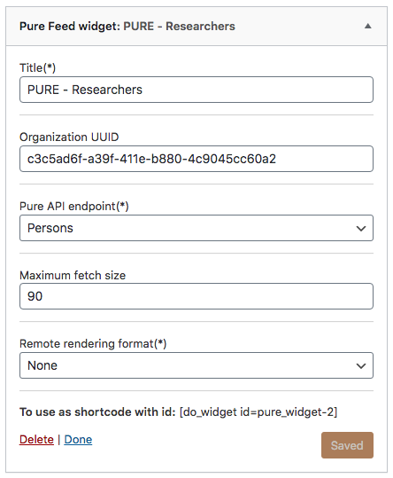

# Pure Feed Widget (WP plugin)

A widget for listing academic publications from Elsevier Pure in WordPress.

## Description

This widget displays persons and publications from [Elsevier Pure](https://www.elsevier.com/solutions/pure) institutional repositories. Compared to the RSS feeds, this hopes to provide a cleaner and more configurable output of publications.

## Installation

- Download an position the move the plugin folder under WordPress's `plugins` folder.
- Use [composer](https://getcomposer.org/) to install dependencies: `composer install` 
- In WordPress activate the plugin.
- Go to Settings/Pure Feed Widget configuration page and set the API URL and the API KEY options.
- Go to Appearance/Widgets, add a Pure Feed Widget widget to a template position
- Configure the widget options

## Plugin Configuration

#### API URL and API KEY
A Pure API url and key is needed for this plugin to work. You can acquire both of them from the Pure administrator.
These two values must be entered in the Pure Feed Widget Configuration page under the Settings menu.
The API URL is normally in the form: `https://your.pure.domain/ws/api/516`.

## Widget Configuration

#### Organisation ID (UUID)
Additionally, organisation ID (UUID) might be needed to filter persons and publications. You can find there on the Pure portal, e.g. the Pure page of MAD Art & Design at IT University of Copenhagen is https://pure.itu.dk/portal/en/organisations/mad-art--design(cf9b4e6a-e1ad-41e3-9475-7679abe7131b).html, and the organisation ID is `cf9b4e6a-e1ad-41e3-9475-7679abe7131b`. Enter these in the widget configuration, and select a bibliographical style, typically perhaps APA or Vancouver.

#### Pure API endpoints
At the time being the widgets are able to handle two distinct endpoints: Persons and Research-Outputs.

#### Maximum fetch size
This number defines how many elements will be queried from the Pure backend. 
For now there is no caching mechanism so a high enough number might produce a timeout and break your site.

#### Remote rendering format (Research-Outputs only)
With this option you can select from a list of available formats defined on your Pure backend to make the rendering to happen on the Pure side instead of receiving the raw values and having to render the output yourself. This is very quick but does not leave much room for flexibility.

#### Other configuration
Any other configuration option that might come into mind is not implemented. This means you have to get your hands dirty and get down to some Php coding. 

## Styling

#### Remote rendering formats
Pure offers rendering items in various bibliographical style. Below is example output with the [APA style](https://apastyle.apa.org/) style, without any fancy CSS.

Example output with the *short* style.

#### Manual rendering
If the above styles do not satisfy you, you have the option of setting the "Remote rendering format" option to "None" and styling freely your output. 

## Development Notes
There are some [notes](./docs/PURE_API_NOTES.md) that were gathered during the development which might come useful for further development.

## Feedback

The primary intented use scenario is to list newest publications in a widget on a webpage of a research group or lab or other organizational unit. Developed primarily for the [MAD Art and Design research group](https://pure.itu.dk/portal/en/organisations/mad-art--design(cf9b4e6a-e1ad-41e3-9475-7679abe7131b).html) at [IT University of Copenhagen](https://www.itu.dk).

Please create issues and pull requests on GitHub, or if you are at ITU, come have a chat :)
